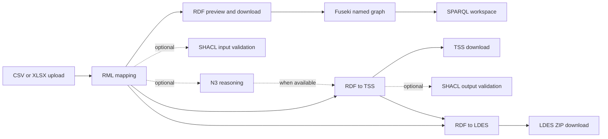
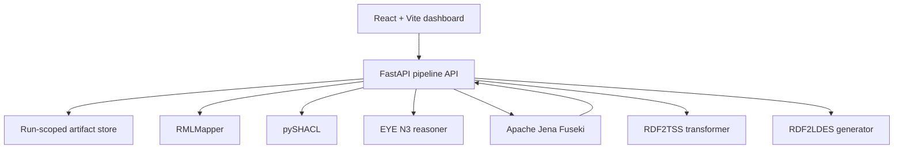

<div align="center">

# Semantic Pipeline Studio

### Turn tabular data into validated, queryable, and publishable linked data

[](https://react.dev/)
[](https://fastapi.tiangolo.com/)
[](https://www.w3.org/RDF/)
[](LICENSE)

A generic, web-based workspace for converting CSV and Excel data to RDF, validating and enriching it, querying it in Apache Jena Fuseki, and packaging it as an LDES.

</div>

---

## Overview

Semantic Pipeline Studio provides one guided interface for a complete semantic-data workflow. Users bring their own tabular data and semantic contracts—the RML mapping, SHACL shapes, N3 rules, graph name, and LDES settings—while the application manages each run and exposes its generated artifacts.

The system is domain-independent. It does not assume a particular dataset or business use case, and uploaded data is stored in an isolated, run-scoped workspace suitable for a cloud deployment model.

## Pipeline at a glance



Optional stages do not block later processing. RDF2TSS uses reasoned RDF when a successful reasoning result exists and otherwise uses the mapped RDF directly. LDES generation can start from either mapped RDF or TSS RDF.

## Features

### 1. Tabular data input

- Upload `.csv` or `.xlsx` files from the browser.
- Inspect parsed columns, rows, and workbook metadata immediately after upload.
- Normalize the active Excel worksheet into a run-scoped CSV source for RMLMapper.
- Combine supported multi-row Excel headings and date/time columns during normalization.
- Clear a selected file before uploading or delete the active run and start over.

### 2. User-provided RML mapping

- Paste a complete RML mapping into the built-in code editor.
- See the exact prepared CSV filename that must be used as `rml:source`.
- Validate the mapping syntax and execute it with RMLMapper.
- Receive readable stage errors without taking down the application.

### 3. Mapped RDF preview and download

- Preview Turtle output between mapping and ingestion.
- Browse RDF by subject, with at most 10 instances per page.
- Move through the full result using previous and next controls.
- Download the complete mapped RDF artifact at any time.

### 4. Apache Jena Fuseki ingestion

- Choose a name or full IRI for the target named graph.
- Clear the target graph before every ingestion to prevent stale or duplicate data.
- Upload the mapped RDF through Fuseki's Graph Store Protocol.
- Keep graph selection explicit rather than silently treating a named graph as the default graph.

### 5. SPARQL query workspace

- Write and run read-only SPARQL queries against Fuseki.
- Select the intended named graph explicitly with `GRAPH <...>` in the query.
- Display `SELECT` results as a table, `ASK` results as a Boolean, and graph-query results as text.
- Cap large responses on the server to keep the interface responsive.

### 6. SHACL input validation

- Paste a SHACL shape and validate the mapped RDF.
- View and download the full SHACL validation report.
- Treat non-conformance as a reportable result—not a system failure—so later stages remain available.

### 7. Optional N3 reasoning

- Paste user-defined N3 rules and execute them with the EYE reasoner.
- Materialize inferred statements alongside the mapped RDF.
- Report inferred and total triple counts.
- Skip reasoning entirely when it is not needed.

### 8. RDF to TSS transformation

- Convert compatible SOSA/QUDT observations into Time Series Snippets.
- Prefer successfully reasoned RDF automatically, with mapped RDF as the fallback.
- Report sensor and output triple counts.
- Preview and download the generated TSS Turtle file.

### 9. SHACL output validation

- Validate generated TSS data against a user-provided output shape.
- Surface non-conformance and the complete validation report without blocking LDES generation.

### 10. RDF or TSS to LDES

- Generate an LDES from either the original mapped RDF or the generated TSS data.
- Configure the stream name and public base URL.
- Build date-based TREE fragments and indexes in a complete folder hierarchy.
- Preview the root TriG index and download the entire LDES directory as a ZIP archive.

## Run and artifact model

Each upload creates an isolated run with its own state, source files, semantic inputs, logs, and generated outputs. Stage failures are recorded on that run and returned to the interface as structured feedback rather than crashing the API.

Artifacts are first-class outputs. Depending on the stages executed, a run can expose:

- the normalized CSV source;
- the submitted RML mapping and mapped RDF;
- SHACL shapes and validation reports;
- N3 rules and reasoned RDF;
- TSS RDF;
- the LDES root index and complete ZIP package.

Deleting an active run removes its uploaded and generated files. Data previously sent to Fuseki is managed separately through its named-graph lifecycle.

## Architecture



| Layer | Responsibility |
| --- | --- |
| React frontend | Guided pipeline, editors, previews, result tables, status feedback, and downloads |
| FastAPI backend | Run lifecycle, validation, stage orchestration, error isolation, and artifact delivery |
| RMLMapper | User-controlled tabular-to-RDF mapping |
| Apache Jena Fuseki | Named-graph storage and SPARQL query execution |
| pySHACL | Input RDF and TSS conformance validation |
| EYE | Optional N3 rule execution and inference materialization |
| RDF2TSS | Conversion of compatible semantic observations to Time Series Snippets |
| RDF2LDES | TREE/LDES hierarchy generation and ZIP packaging |

## API surface

| Endpoint | Purpose |
| --- | --- |
| `GET /api/health` | API health check |
| `GET /api/config` | Fuseki and local tool readiness |
| `POST /api/runs` | Create a run from a CSV or XLSX upload |
| `GET /api/runs/{run_id}` | Retrieve current run state |
| `DELETE /api/runs/{run_id}` | Delete a run and its files |
| `POST /api/runs/{run_id}/stages/rml` | Run the supplied RML mapping |
| `GET /api/runs/{run_id}/rdf-preview` | Retrieve a paginated mapped-RDF preview |
| `POST /api/runs/{run_id}/stages/ingest` | Clear and replace a Fuseki named graph |
| `POST /api/runs/{run_id}/sparql` | Execute a SPARQL query |
| `POST /api/runs/{run_id}/stages/shacl-in` | Validate mapped RDF |
| `POST /api/runs/{run_id}/stages/reason` | Apply N3 reasoning rules |
| `POST /api/runs/{run_id}/stages/rdf2tss` | Generate TSS RDF |
| `POST /api/runs/{run_id}/stages/shacl-out` | Validate TSS RDF |
| `POST /api/runs/{run_id}/stages/rdf2ldes` | Generate and package an LDES |
| `GET /api/runs/{run_id}/artifacts/{artifact_id}` | Download a generated artifact |

## Repository structure

```text
.
├── frontend/                    # React dashboard and Vite configuration
├── pipeline/                    # FastAPI API, orchestration, run store, and tests
├── RDF2TSS_V2/                  # RDF-to-TSS transformation
├── RDF2LDES/                    # TSS/RDF-to-LDES generation
├── SHACL/                       # SHACL validation adapter
├── triple_store_ingestion/      # Fuseki graph-store and query client
├── test-data/                   # Preserved sample data and semantic contracts
├── graphify-out/                # Current code-topology graph and report
├── requirements.txt             # Backend runtime dependencies
└── LICENSE                      # MIT license
```

## Sample assets

The preserved `test-data/` directory contains a representative Excel workbook, CSV source, RML mapping, and input/output SHACL shapes. These files can be used to exercise the pipeline and as references for the expected semantic inputs. Before running the included RML mapping, update its `rml:source` value to match the prepared CSV filename shown by the dashboard.

## Current compatibility contract

RDF2TSS and RDF2LDES currently use the project's existing semantic queries. Mapped RDF intended for these stages must therefore provide the SOSA observation structure, sensor, timestamp, simple result, observed property, and QUDT unit expected by those queries. Making these transformation queries user-configurable is intentionally left for a later iteration.

For Excel uploads, the active worksheet is used. RMLMapper receives the normalized CSV artifact rather than the original workbook, and the dashboard displays its exact logical-source filename.

## Installation

### Prerequisites

Install the following software before starting the application:

- **Python 3.10 or newer** for the FastAPI backend and semantic-processing modules.
- **Node.js and npm** for the React/Vite frontend.
- **Java** for running RMLMapper.
- **RMLMapper** for converting uploaded tabular data to RDF.
- **EYE reasoner** for the optional N3 reasoning stage.
- **Apache Jena Fuseki** for named-graph ingestion and SPARQL queries.

### 1. Install the backend dependencies

From the repository root, create and activate a Python virtual environment.

Windows PowerShell:

```powershell
python -m venv .venv
.\.venv\Scripts\Activate.ps1
python -m pip install --upgrade pip
python -m pip install -r requirements.txt
```

macOS or Linux:

```bash
python3 -m venv .venv
source .venv/bin/activate
python -m pip install --upgrade pip
python -m pip install -r requirements.txt
```

### 2. Add RMLMapper

Download an executable JAR from the [official RMLMapper releases](https://github.com/RMLio/rmlmapper-java/releases) and place it directly inside the repository's `pipeline/` directory. The file must be named exactly:

```text
pipeline/rmlmapper.jar
```

The JAR is intentionally excluded from Git because of its size. Use the Java version required by the RMLMapper release you download; for example, RMLMapper 8.1.0 requires Java 21 or newer. Confirm that Java is available before starting the backend:

```bash
java -version
```

The dashboard's service-status strip reports whether the backend can find `rmlmapper.jar`.

### 3. Install the EYE reasoner

Install the native [EYE reasoner](https://eyereasoner.github.io/eye/) for your platform and ensure the `eye` command is available on the system `PATH`:

```bash
eye --help
```

The rest of the pipeline can run without EYE, but the optional N3 reasoning stage requires it. If EYE is installed under a different command or path, set the `EYE_COMMAND` environment variable before starting the backend.

### 4. Start Apache Jena Fuseki

Download and unpack [Apache Jena Fuseki](https://jena.apache.org/download/). Run it on port `3030` and create a dataset named `dataset`; the backend then uses these endpoints:

```text
Graph Store endpoint: http://localhost:3030/dataset/data
SPARQL endpoint:     http://localhost:3030/dataset/query
```

Keep Fuseki running while using ingestion or SPARQL features. A different deployment can be configured with the `FUSEKI_DATA_URL` and `FUSEKI_QUERY_URL` environment variables.

For a temporary in-memory dataset suitable for local testing, run one of these commands from the unpacked Fuseki directory:

macOS or Linux:

```bash
./fuseki-server --update --mem /dataset
```

Windows:

```powershell
.\fuseki-server.bat --update --mem /dataset
```

Fuseki uses port `3030` by default. An in-memory dataset is erased when Fuseki stops; use Fuseki's persistent TDB configuration when the data must survive restarts.

### 5. Install the frontend dependencies

From the repository root:

```bash
cd frontend
npm install
```

## Running the application

The backend, frontend, and Fuseki must run at the same time. Use separate terminal windows for each process.

### 1. Run Fuseki

Start the Fuseki server on port `3030` and make sure the `dataset` dataset is available.

### 2. Run the backend API

From the repository root, with the Python virtual environment activated:

```bash
python -m uvicorn pipeline.playground_server:app --reload --host 0.0.0.0 --port 8000
```

The API is then available at `http://localhost:8000`, and its interactive documentation is available at `http://localhost:8000/docs`.

### 3. Run the frontend

From the `frontend/` directory:

```bash
npm run dev
```

Open the URL printed by Vite, normally `http://localhost:5173`.

## Testing the pipeline with `test-data`

The files in `test-data/` can be used to run through the dashboard:

- `sample.xlsx` and `waterinfo.csv` are uploadable tabular sources.
- `rml.ttl.txt` is an example RML mapping.
- `SHACL_in.ttl` is an example shape for validating mapped RDF.
- `SHACL_out.ttl` is an example shape for validating TSS output.

The sample files are references rather than a hard-coded application dataset. Paste the relevant text files into the matching dashboard editors and adjust the RML logical source as described below.

## Important mapping and transformation constraints

### RML logical-source filename

The filename in `rml:source` must exactly match the prepared CSV filename for the uploaded file. The dashboard displays this filename after upload under **RML source name**.

- Uploading `waterinfo.csv` produces the RML source name `waterinfo.csv`.
- Uploading `sample.xlsx` converts its active worksheet to CSV and produces the RML source name `sample.csv`.

For example, when `sample.xlsx` is uploaded, the mapping must contain:

```turtle
rml:logicalSource [
    rml:source "sample.csv" ;
    rml:referenceFormulation ql:CSV
] ;
```

Do not use an absolute local path. Uploaded files are copied into an isolated run directory, and RMLMapper executes from that directory. Column names referenced by `rr:template` or `rml:reference` must also exactly match the prepared CSV headers shown in the upload preview.

### RDF2TSS and RDF2LDES input structure

RDF2TSS and RDF2LDES currently use the existing built-in semantic queries. For these transformations to work, the selected RDF input must contain the structure expected by those queries:

- a SOSA observation associated with a sensor through `sosa:madeBySensor`;
- a timestamp through `sosa:resultTime`;
- a value through `sosa:hasSimpleResult`;
- an observed property through `sosa:observedProperty`; and
- a QUDT unit through `qudt:hasUnit`.

If any required relationship is absent or uses a different vocabulary, mapping may still produce valid RDF, but the current TSS or LDES transformation can produce no usable output.

## Project status

The functional pipeline, dashboard, and local installation instructions are in place. Cloud-deployment instructions will be added in a dedicated documentation pass.

## License

This project is available under the [MIT License](LICENSE).
